<!-- Animated Header -->
<div align="center">
  
</div>

<!-- Dynamic Typing Animation -->
<div align="center">
  
</div>

<!-- Elite Status Badges -->
<div align="center">
  
  
  
  
</div>

<br>

<!-- Professional Contact Bar -->
<div align="center">
  <a href="https://cosimo.dev" target="_blank">
    
  </a>
  <a href="mailto:info@cosimo.dev">
    
  </a>
  <a href="#" target="_blank">
    
  </a>
</div>

---

## 🎯 MANIFESTO PROFESSIONALE

<div align="center">
<table>
<tr>
<td align="center" width="33%">

### 🚀 **VISIONE**
*Trasformo idee complesse in architetture digitali scalabili, combinando innovation cloud-native con performance ottimizzate per creare esperienze utente eccezionali.*

</td>
<td align="center" width="33%">

### ⚡ **MISSIONE**  
*Implemento soluzioni tecnologiche all'avanguardia che generano valore business misurabile, utilizzando metodologie agili e best practices enterprise.*

</td>
<td align="center" width="33%">

### 💡 **FILOSOFIA**
*Ogni linea di codice è un investimento nel futuro. Ogni ottimizzazione è un passo verso l'eccellenza. Ogni progetto è un'opportunità di innovazione.*

</td>
</tr>
</table>
</div>

---

## 🏗️ EXPERTISE ARCHITECTURE

```mermaid
flowchart TB
    subgraph "🎯 CORE COMPETENCIES"
        A[🔥 Backend Engineering] --> B[⚡ Frontend Innovation]
        B --> C[☁️ Cloud Architecture] 
        C --> D[📊 Data & Analytics]
        D --> E[🛡️ Security & Performance]
        E --> A
    end
    
    subgraph "🚀 SPECIALIZATIONS"
        F[Google Search Console<br/>Advanced Implementation]
        G[Microservices Architecture<br/>& API Design]
        H[Real-time Analytics<br/>& Business Intelligence]
        I[Performance Optimization<br/>& Scalability Engineering]
    end
    
    A --> F
    B --> G
    C --> H
    D --> I
```

<div align="center">



</div>

---

## 💻 TECHNOLOGY MASTERY MATRIX

<div align="center">

### 🔥 **BACKEND DOMINANCE**
<table>
<tr>
<td align="center"></td>
<td align="center"></td>
<td align="center"></td>
<td align="center"></td>
</tr>
<tr>
<td align="center"></td>
<td align="center"></td>
<td align="center"></td>
<td align="center"></td>
</tr>
</table>

### ⚡ **FRONTEND EXCELLENCE** 
<table>
<tr>
<td align="center"></td>
<td align="center"></td>
<td align="center"></td>
<td align="center"></td>
</tr>
<tr>
<td align="center"></td>
<td align="center"></td>
<td align="center"></td>
<td align="center"></td>
</tr>
</table>

### ☁️ **CLOUD INFRASTRUCTURE MASTERY**
<table>
<tr>
<td align="center"></td>
<td align="center"></td>
<td align="center"></td>
<td align="center"></td>
</tr>
<tr>
<td align="center"></td>
<td align="center"></td>
<td align="center"></td>
<td align="center"></td>
</tr>
</table>

### 📊 **DATA & ANALYTICS SUPREMACY**
<table>
<tr>
<td align="center"></td>
<td align="center"></td>
<td align="center"></td>
<td align="center"></td>
</tr>
<tr>
<td align="center"></td>
<td align="center"></td>
<td align="center"></td>
<td align="center"></td>
</tr>
</table>

</div>

---

## 📊 PERFORMANCE ANALYTICS & GITHUB INSIGHTS

<div align="center">

<table>
<tr>
<td>

</td>
<td>

</td>
</tr>
</table>


</div>

---

## 🚀 PROGETTI ELITE & CASE STUDIES

<div align="center">

<table>
<tr>
<td width="50%">

### 🔥 **ENTERPRISE SEO ANALYTICS PLATFORM**
```yaml
Progetto: Dashboard Analytics Cloud Enterprise
Complessità: ⭐⭐⭐⭐⭐
Status: 🚀 Production

Tecnologie:
  - Backend: Python, FastAPI, Celery
  - Frontend: React, Redux, D3.js
  - Cloud: GCP, Kubernetes, Redis
  - APIs: Search Console, Analytics GA4
  
Performance:
  - 📊 2M+ query/day processate
  - ⚡ Sub-100ms response time
  - 🔄 Real-time data streaming
  - 📈 99.9% uptime SLA
```

</td>
<td width="50%">

### ⚡ **MICROSERVICES E-COMMERCE ARCHITECTURE**
```yaml
Progetto: Piattaforma E-commerce Scalabile
Complessità: ⭐⭐⭐⭐⭐
Status: 🏆 Award Winner

Tecnologie:
  - Backend: Node.js, GraphQL, Docker
  - Frontend: Angular, NgRx, Ionic
  - Database: PostgreSQL, Elasticsearch
  - Infrastructure: AWS, Terraform
  
Risultati:
  - 👥 50k+ utenti concorrenti
  - 💰 300% aumento conversioni  
  - ⚡ 70% miglioramento performance
  - 🛡️ Zero security breaches
```

</td>
</tr>
</table>

<table>
<tr>
<td width="50%">

### 🌐 **AI-POWERED SEO OPTIMIZATION SUITE**
```yaml
Progetto: Suite Ottimizzazione AI-Driven
Complessità: ⭐⭐⭐⭐⭐
Status: 🎯 Industry Leading

Stack Tecnologico:
  - AI/ML: Python, TensorFlow, scikit-learn
  - Backend: Django, DRF, Celery
  - Frontend: Vue.js, Nuxt.js, Chart.js
  - DevOps: Docker, GitLab CI/CD
  
Impact Business:
  - 📈 400% miglioramento ranking
  - 🚀 85% riduzione tempi ottimizzazione
  - 💎 ROI 250% per i clienti
  - 🏅 Industry Recognition Award
```

</td>
<td width="50%">

### 🔧 **REAL-TIME MONITORING & ALERTING SYSTEM**
```yaml
Progetto: Sistema Monitoraggio Enterprise
Complessità: ⭐⭐⭐⭐⭐  
Status: 🛡️ Mission Critical

Architettura:
  - Monitoring: Prometheus, Grafana
  - Backend: Go, Apache Kafka, InfluxDB
  - Frontend: React, WebSocket, PWA
  - Cloud: Multi-cloud deployment
  
Metriche Chiave:
  - ⏱️ <1s detection time
  - 📱 Multi-channel alerting
  - 📊 Custom business metrics
  - 🔄 Self-healing capabilities
```

</td>
</tr>
</table>

</div>

---

## 🎯 ROADMAP INNOVAZIONE 2025

<div align="center">


</div>

---

## 🏆 RICONOSCIMENTI & CERTIFICAZIONI

<div align="center">

<table>
<tr>
<td align="center" width="25%">

<br><strong>Cloud Architecture</strong>
</td>
<td align="center" width="25%">

<br><strong>Enterprise Solutions</strong>
</td>
<td align="center" width="25%">

<br><strong>Optimization Master</strong>
</td>
<td align="center" width="25%">

<br><strong>Cybersecurity Pro</strong>
</td>
</tr>
</table>

</div>

---

## 💼 COLLABORAZIONE ENTERPRISE

<div align="center">

### 🎯 **READY FOR YOUR NEXT BREAKTHROUGH PROJECT?**

<table>
<tr>
<td align="center" width="33%">

#### 🚀 **STARTUP ACCELERATION**
*Trasformo la tua MVP in una piattaforma scalabile enterprise-ready con architetture cloud-native e performance ottimizzate.*

</td>
<td align="center" width="33%">

#### 🏢 **ENTERPRISE SOLUTIONS**  
*Implemento soluzioni mission-critical per grandi organizzazioni con focus su affidabilità, sicurezza e compliance.*

</td>
<td align="center" width="33%">

#### 🎓 **TECHNICAL CONSULTING**
*Offro consulenza strategica per decisioni tecnologiche, code review e ottimizzazione di architetture esistenti.*

</td>
</tr>
</table>

### 📞 **CONTATTI PROFESSIONALI**

<a href="mailto:info@cosimo.dev">
  
</a>
<a href="https://cosimo.dev" target="_blank">
  
</a>
<a href="#" target="_blank">
  
</a>

</div>

---

## 🌟 MOTTO PROFESSIONALE

<div align="center">

</div>

<!-- Animated Footer -->
<div align="center">
  
</div>
